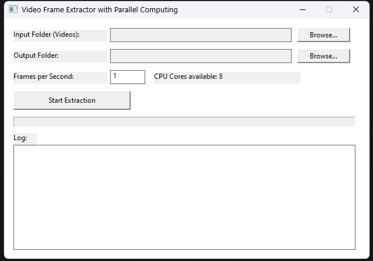
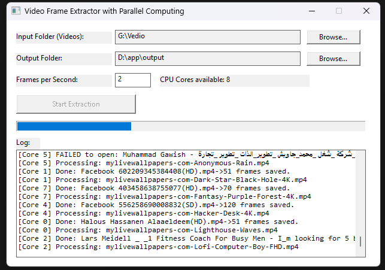

# Video Frame Extractor Tool

<p align="center">
  
  
</p>

---

## Table of Contents

- [Description](#description)
- [Features](#features)
- [How to Use](#how-to-use)
- [Output Structure](#output-structure)
- [Supported Video Formats](#supported-video-formats)
- [Project Structure](#project-structure)
- [Requirements](#requirements)
- [Installation](#installation)
- [Technologies Used](#technologies-used)
- [License](#license)

---

## Description

Video Frame Extractor Tool is a high-performance Windows desktop application built with C++, WinAPI, OpenCV, and OpenMP for extracting frames from video files efficiently using parallel processing.

The application allows users to:
- Select folders containing multiple videos
- Extract frames automatically
- Process videos in parallel using multiple CPU cores
- Save extracted frames into organized output folders
- Monitor progress and logs in real time

---

## Features

| Feature | Detail |
|---|---|
| Parallel processing | OpenMP — videos processed simultaneously across all CPU cores |
| Frame extraction | OpenCV — reliable decoding of MP4, AVI, MOV, MKV, WMV, FLV, WEBM |
| Simple GUI | Native Win32 — browse folders, set FPS, live log, progress bar |
| Output structure | One sub-folder per video, frames named `frame_000000.jpg` … |


---

## How to Use

1. Launch the application
2. **Input Folder** — Click *Browse* and select the folder that contains your video files.
3. **Output Folder** — Click *Browse* and select where the extracted frames will be saved.
4. **Frames per Second** — Enter how many frames to extract per second of video (e.g. `5` = five frames per second).
5. Click **▶ Start Extraction**.

The tool will:
- Scan the input folder for video files (`.mp4`, `.avi`, `.mov`, `.mkv`, `.wmv`, `.flv`, `.webm`).
- Create one sub-folder per video inside the output folder (named after the video).
- Process all videos **in parallel** — one thread per video, up to the number of CPU cores detected.
- Show live progress in the log and progress bar.

---

## Output Structure

```
OutputFolder\
├── video1\
│   ├── frame_000000.jpg
│   ├── frame_000001.jpg
│   └── ...
├── video2\
│   ├── frame_000000.jpg
│   └── ...
└── ...
```


---

## Supported Video Formats

The tool currently supports:

- MP4
- AVI
- MOV
- MKV
- WMV
- FLV
- WEBM

---

## Project Structure

```text
video-frame-extractor-tool/
│
├── installer/                     
│   └── VideoFrameExtractorSetup.exe   # Windows app installer
│
├── release/                       
│   ├── VideoFrameExtractor.exe        # Main application
│   ├── msvcp140.dll                   # MSVC runtime library
│   ├── opencv_world4120.dll           # OpenCV library
│   ├── vcomp140.dll                   # OpenMP runtime
│   ├── vcruntime140.dll               # Visual C++ runtime
│   └── vcruntime140_1.dll             # Additional runtime library
│
├── screenshots/                   
│   ├── app_1.png                      # Main UI screenshot
│   └── app_2.png                      # Progress/log screenshot
│
├── src/                          
│   ├── CMakeLists.txt                 # CMake build configuration
│   └── main.cpp                       # Main application source code
│
├── README.md                          # Project documentation
└── LICENSE                            # MIT license
```

---

## Requirements

### Runtime Requirements

- Windows 10 / Windows 11
- OpenCV Runtime DLL
- Microsoft Visual C++ Runtime

### Build Requirements

- Visual Studio 2019 or newer
- C++17
- OpenCV
- OpenMP

---

## Installation

### Option 1 — Installer

Download the latest installer from the Releases section:

```text
VideoFrameExtractorSetup.exe
```

Run the installer and follow the setup instructions.

---

### Option 2 — Portable Version

1. Download the portable release files
2. Extract the folder
3. Run:

```text
VideoFrameExtractor.exe
```

---

## Technologies Used

- C++
- WinAPI
- OpenCV
- OpenMP
- Windows API
- STL Filesystem

---

## License

This project is licensed under the MIT License.
